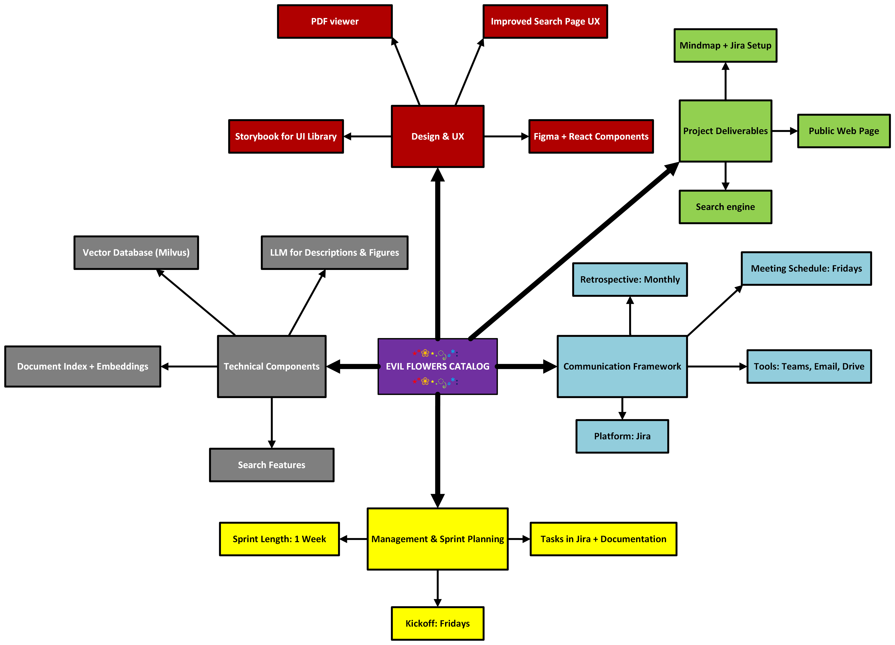

import { useColorMode } from '@docusaurus/theme-common';

# Tímová dokumentácia

## Mind map

## Roadmap
{
  (() => {
    const { colorMode } = useColorMode();
    const imageSrc = colorMode === 'dark' ? '../img/roadmap_dark.png' : '../img/roadmap_light.png';

    return ;
  })()
}